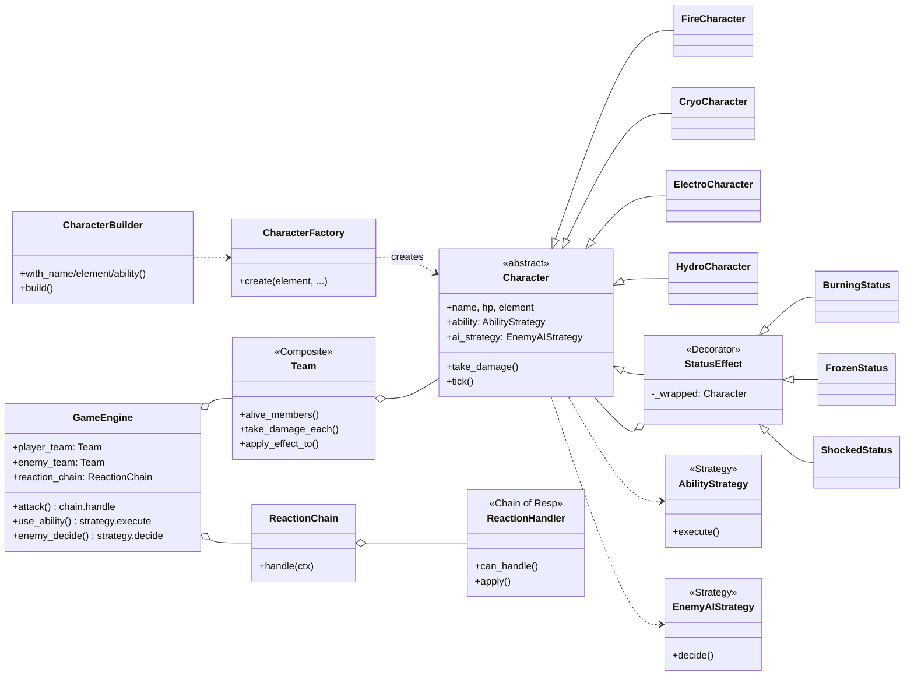

# Element Blast — Mini Oyun Motoru

**Konu Seçimi: C — Mini Oyun Motoru**

3v3 sıra tabanlı elemental dövüş. Dört element arası reaksiyon kuralları, karakter yetenekleri ve düşman AI'sı — hepsi tasarım örüntüleriyle genişletilebilir şekilde yapılandırıldı. Bu proje Yazılım Tasarım Örüntüleri ödevinin 3 faz boyunca evrilmiş halidir.

[](https://github.com/atlamayanat/ELEMENT-BLAST/actions/workflows/ci.yml)

---

## Ne Yapıyor

- **4 element:** Fire, Cryo, Electro, Hydro
- **7 reaksiyon:** Fire→Cryo 2x, Fire↔Hydro 1.5x + yanma, Cryo→Hydro dondurma, Hydro→Electro AoE, Electro→Fire sıçrama + şok, default
- **4 yetenek:** Fire Blast (1.5x tek hedef), Freeze Ray (dondurma), Thunder Chain (AoE), Tidal Wave (AoE)
- **3 status efekti (yığılabilir):** Burning (3 tur DoT), Frozen (1 tur sıra atlatma), Shocked (sonraki hasar +%50)
- **2 oyun modu:** Quick start (varsayılan 3v3) ve Custom draft (havuzdan seç)
- **Defensive AI:** Düşmanlar HP düşükken yetenek bias'lı kararlar veriyor

## Mimari



---

## Kullanılan Tasarım Örüntüleri

| # | Pattern | Kategori | Faz | Konum | Çözdüğü Sorun |
|---|---------|----------|-----|-------|----------------|
| 1 | **Factory Method** | Creational | 1 | [characters/factory.py](src/game/characters/factory.py) | Element type-check zincirleri (engine'de if-elif) |
| 2 | **Builder** | Creational | 1 | [characters/builder.py](src/game/characters/builder.py) | Karakter kurulumunda esneklik |
| 3 | **Composite** | Structural | 2 | [team.py](src/game/team.py) | AoE kod tekrarı, HP-cap hack |
| 4 | **Decorator** | Structural | 2 | [effects/status.py](src/game/effects/status.py) | Status efektleri Character'a sızıyordu |
| 5 | **Strategy** (Ability) | Behavioral | 3 | [abilities/](src/game/abilities/) | Yetenek if-elif zinciri |
| 6 | **Strategy** (AI) | Behavioral | 3 | [ai/](src/game/ai/) | Tek tip düşman davranışı |
| 7 | **Chain of Responsibility** | Behavioral | 3 | [reactions/](src/game/reactions/) | Reaksiyon if-elif zinciri |

Detaylı belgeleme: [PATTERNS.md](PATTERNS.md).

### OCP Demonstrasyonu (Faz 3)

Chain of Responsibility sayesinde yeni bir elemental reaksiyon eklemek **engine.py'ye dokunmadan** mümkün:

```python
class CryoElectroHandler(ReactionHandler):
    def can_handle(self, ctx):
        return ctx.attacker.element == "cryo" and ctx.target.element == "electro"
    def apply(self, ctx):
        ...

engine.reaction_chain.append(CryoElectroHandler())
```

Bu OCP uyumunu kanıtlayan test: [tests/test_smoke.py::test_ocp_new_reaction_handler_appended_without_engine_change](tests/test_smoke.py).

---

## Nasıl Çalıştırılır

Python 3.11+ gerekli. Proje kökünden:

```bash
python run.py
```

veya:

```bash
python -m src.game.main
```

> IDE'den çalıştırırken `run.py`'yi açıp çalıştırın, `main.py`'yi değil — `main.py` paket içinden çağrıldığı varsayımıyla import yapıyor.

### Kontroller

Her tur:
1. Mod seç: `q` (quick start) veya `c` (custom draft — havuzdan 3 karakter)
2. Karakter sırası gelince aksiyon: `a` (saldırı) veya `s` (özel yetenek)
3. Tek hedefli aksiyonlarda rakip numarası gir

## Testler

```bash
pip install pytest
pytest tests/ -v
```

12 smoke test: Composite, Decorator, Strategy, CoR ve OCP demosu dahil. CI her push'ta otomatik çalıştırır.

---

## Repo Yapısı

```
.
├── README.md              ← bu dosya
├── PATTERNS.md            ← tüm örüntülerin detayı
├── PROBLEMS.md            ← Faz 0 analizi + AI karşılaştırması
├── pyproject.toml
├── run.py                 ← giriş noktası
├── src/game/
│   ├── characters/        ← Factory Method, Builder, Character hiyerarşisi
│   ├── effects/           ← Decorator (StatusEffect)
│   ├── team.py            ← Composite
│   ├── abilities/         ← Strategy (yetenekler)
│   ├── ai/                ← Strategy (enemy AI)
│   ├── reactions/         ← Chain of Responsibility
│   ├── engine.py
│   └── main.py
├── tests/                 ← pytest smoke + OCP demo
├── docs/
│   ├── diagrams/          ← UML (.puml) faz-faz
│   └── ai-log/            ← AI etkileşim kayıtları
└── .github/workflows/ci.yml
```

## Faz Geçmişi

| Faz | Branch | Konu | Puan |
|-----|--------|------|------|
| 0 | `main` | Bilinçsiz başlangıç — God Class, if-elif zincirleri | — |
| 1 | `phase-1` | Creational: Factory Method + Builder | 25 |
| 2 | `phase-2` | Structural: Composite + Decorator | 30 |
| 3 | `phase-3` | Behavioral: Strategy + Chain of Responsibility + CI | 35 |
